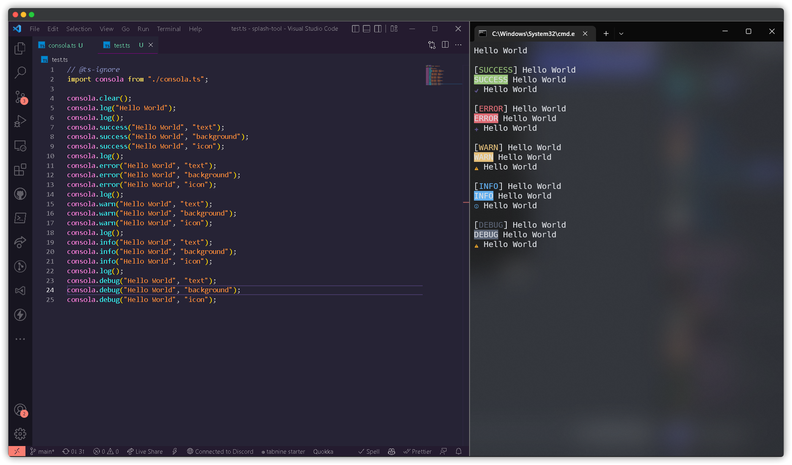

# consola
Hello this is a package i made for my laziness of adding color to the consoles so i can have access to it faster

Is made with deno, and you can run it with `yarn test` or `npm run test`

Remember that you can always make a pull-request or a issue and ill respond to it as fast as i can.
Hope you like it :)

